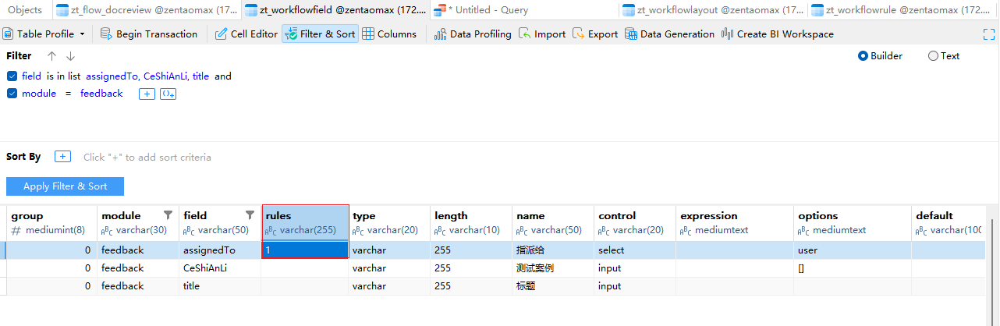
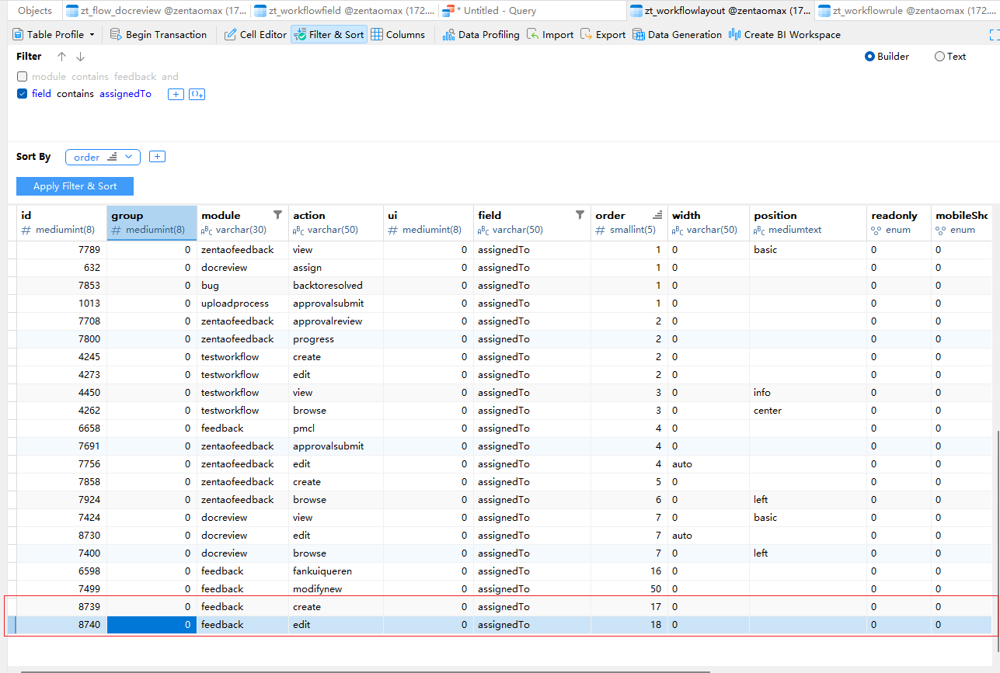

# 在extension-->max-->feedback模块中增加创建和编辑指派人为必填字段

## 字段：assignedTo

### 修改内容如下：
    
####    1、在feedback模块ui目录中的create.html.php文件，创建反馈时增加指派人字段为必填,代码如下:
```
        formRow
        (
            formGroup
            (
                set::label($lang->feedback->assignedTo),
                set::width('1/2'),
                set::required(true),
                picker
                (
                    set::name('assignedTo'),
                    set::items($users),
                    set::value(isset($feedback) ? $feedback->assignedTo : ''),
    
                )
            )
        ),
```
####    2、在feedback模块下ui目录中的edit.html.php文件，编辑反馈时增加指派人字段为必填，代码如下：
```
        formRow
        (
            formGroup
            (
                setID('assignedTo'),
                set::label($lang->feedback->assignedTo),
                set::width('1/2'),
                picker
                (
                    set::name('assignedTo'),
                    set::items($users),
                    set::value($feedback->assignedTo),
        
                ),
                set::required(true),
            )
        ),
```
####    3、以上代码增加后，需要在zt_workflowfield表中将assignedTo规则改为1必填，否则不生效，如图：


####    4、最后需要在zt_workflowlayout表中新增两条assignedTo的创建和编辑数据，并将order进行排序，如图：

####    5、数据库修改规则后，按照4步骤增加数据后，1、2代码增加才能生效